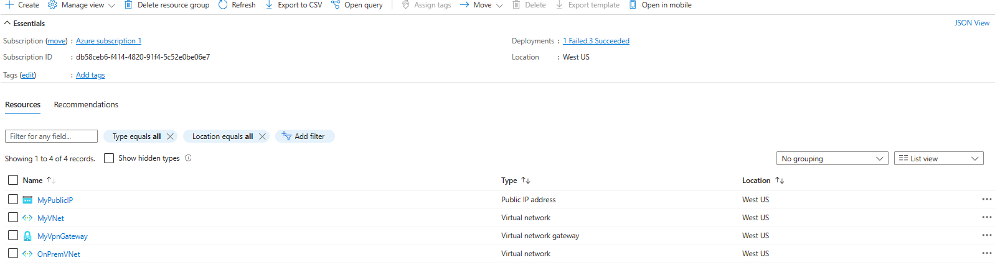

# NetMaze
---
    title: 'VNetMaze Explorer'
    module: 'Implement and manage virtual networking'
---
## Project introduction
Design a hybrid networking environment where on-premises networks connect securely to Azure resources using Azure's networking capabilities, 
ensuring secure data transition and effective resource access controls.

## Azure Resources Used
+ Azure Virtual Networks
+ Azure VPN Gateway
+ Network Security Groups (NSGs)
+ Azure Bastion
+ Azure Private Link
+ Azure DNS
+ Azure Load Balancer

## Diagram
Link for the Diagram: https://github.com/akurtic1/NetMaze/blob/17ca6f7e759e4a43eca64ba3503292ac55445245/Media/az-104.png

## Tasks - Step by Step

### Task 1: Provision VNet and create multiple subnets for different resources (for example: DataSubnet, AdminSubnet...)

So, in this task, I used Azure CLI to provision Vnet and create multiple subnets.
As a result, It was deployed successfully and you can see my command prompt file how I started the provisioning process.

Also, I checked on the Azure Portal to confirm that everything is deployed.

### Task 2: Making another VNet to simulate on-premises environment.

In this task, I used the same command for deploying another VNet, only of course with a different names and IP prefixes.
Command I used for this task: az network vnet create --resource-group az-104 --name OnPremVNet --address-prefixes 192.168.0.0/16 --subnet-name OnPremSubnet --subnet-prefix 192.168.1.0/24

### Task 3: Implementing Azure VPN gateway to create site-to-site VPN connection between simulated on-prem env(VNet) and my main Azure VNet which
I created on the "Task 1".

First, in this task I created a VPN Gateway subnet. Before creating a VPNGateway in my main VNet, I had to create
a Public IP first with the following command: az network public-ip create --resource-group az-104 --name MyPublicIP --sku Standard --allocation-method Static

So, when I wanted to Create a VPN Gateway in my Main VNet, I received the error.

With help of ChatGPT and Copilot, I still couldn't figure out what was the problem until I 
didn't raliste that I didn't have to put the Public IP address as a number but as a resource.

This is the command I used to successfully deploy the VPN Gateway: 
az network vnet-gateway create --resource-group az-104 --name MyVpnGateway --vnet MyVNet --gateway-type Vpn --sku VpnGw1 --vpn-type RouteBased --public-ip-address MyPublicIP --no-wait

After deploying the VPN gateways, I used the following VPN Gateways to connect the Virtual Networks.
As you can see on the screenshot below, it is connected.

### Link to my command prompt history and commands: [Media/cli-creating-vnet-t1.txt](https://github.com/akurtic1/NetMaze/blob/17ca6f7e759e4a43eca64ba3503292ac55445245/Media/cli-creating-vnet-t1.txt)

### Task 4: Deploying a test resources in each subnet of main Virtual Network.

So, In this task I have deployed the test resources in the virtual network for each subnet.
In this task, I have used Azure Portal to deploy the following resources.

### Task 5: Deploying a NSG (Network Security Group) to define inbound and outbound rules.

In the previous task, when I deployed the test VMs, I already assigned the NSG, so 
in this case, I was assigning the NSG rules. As you can see on the screenshot below,
I have assigned the NSG rules and you can see all the information such as destination, source, protocol...

### Task 6: Implementing Azure Bastion

So, in this task I have deployed the Azure Bastion. When I tried to deploy the Azure Bastion,
the error message was stating that I need to create a new subned with the name "AzureBastionSubnet" with the prefix with at least /26.

After deploying the Azure Bastion, I still had to configure the NSG rules that will allow inboud traffic
only from Azure Bastion's IP ranges. For the inboud rule I defined that inbound rule allow traffic on port 433(HTTPS) from the internet.
For the outbound rule I defined to allow outbound traffic from Azure Bastion to VM's on port 22(Because I have deployed a Linux image for VM)
If I deployed a Windows image, I would put port 3389.

### Task 7: Implementing Azure Private Link

In this task, I deployed a Private Endopoint. When I tried to deploy a Private Endpoint, I couldn't select my
VM's because they are not supported. Instead of that, I tried to test it with deploying My SQl Server and
withing deploying SQL server, I also configured a Private Endpoint.

You can see on the screenshot below that Private Endpoint is deployed with "approved" state.

### Task 8: DNS and Load Balancing

As for the DNS & Load Balancing task, I deployed both of theese resources and checked the configuration and properties for these resources.
Most of the resources are deployed with the way to test and learn about the resources and how they are configured. Especially for the last
task when it comes about Load Balancing.
